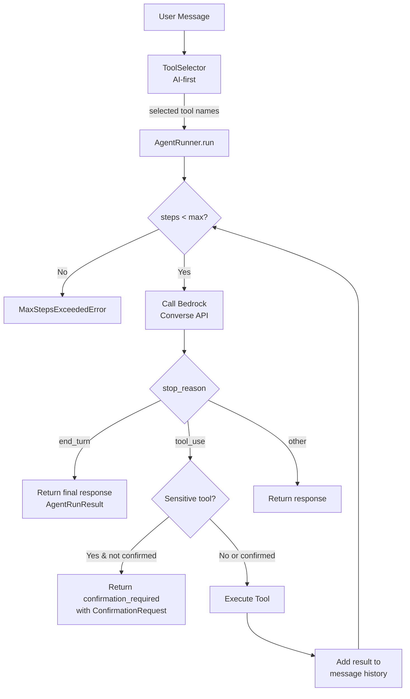
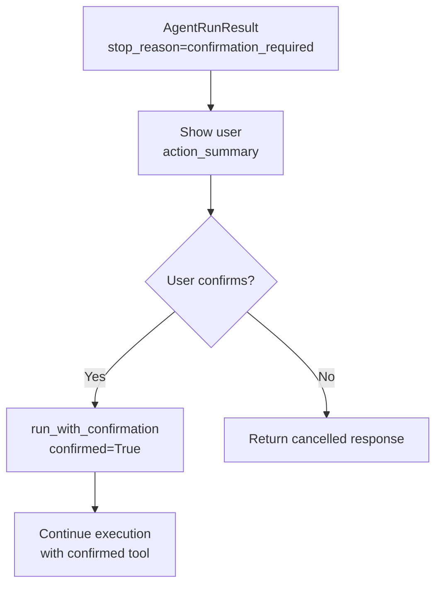

# Personal AI Automation

## Project Goal
This project is a personal, cloud-hosted AI assistant designed to automate day-to-day information workflows through a single conversational interface.

The assistant is accessed via a private 1:1 Telegram chat, where it can both proactively send notifications and respond interactively to questions and follow-up requests. It is intended to act as a persistent, context-aware assistant rather than a stateless chatbot.

The primary use cases include:
- summarising blog posts and articles received via email
- scraping and summarising daily content such as Medium digests
- answering questions and performing small automated tasks via natural language reducing manual overhead in recurring personal workflows

The system maintains conversational context across sessions using persisted history and summaries, allowing it to build continuity over time.

## Architecture Overview

This section provides a high-level overview of how the system works, intended as context for designing new features and PRDs.

### System Components

```
┌─────────────────────────────────────────────────────────────────────────────┐
│                              INGRESS LAYER                                  │
├─────────────────────────────────────────────────────────────────────────────┤
│  Telegram Bot          │  FastAPI REST API       │  Dagster Schedules       │
│  (future: 2-way chat)  │  (HTTP endpoints)       │  (cron-based triggers)   │
└─────────────────────────────────────────────────────────────────────────────┘
                                      │
                                      ▼
┌─────────────────────────────────────────────────────────────────────────────┐
│                              AI AGENT LAYER                                 │
├─────────────────────────────────────────────────────────────────────────────┤
│  ToolSelector          │  AgentRunner            │  ToolRegistry            │
│  (AI-first tool        │  (Bedrock Converse      │  (12 tools across        │
│   selection)           │   reasoning loop)       │   3 domains)             │
│                        │                         │                          │
│  • Analyses intent     │  • Multi-step execution │  • Tasks: CRUD           │
│  • Picks relevant      │  • HITL confirmation    │  • Goals: CRUD           │
│    tools (≤5)          │  • Max 5 steps/run      │  • Reading List: CRUD    │
└─────────────────────────────────────────────────────────────────────────────┘
                                      │
                                      ▼
┌─────────────────────────────────────────────────────────────────────────────┐
│                            DOMAIN SERVICES                                  │
├─────────────────────────────────────────────────────────────────────────────┤
│  NotionClient          │  TelegramService        │  NewsletterService       │
│  (Notion API wrapper)  │  (message sending)      │  (email processing)      │
│                        │                         │                          │
│  • Query databases     │  • Format messages      │  • Fetch from Graph API  │
│  • Create/update pages │  • Send alerts          │  • Parse HTML content    │
│  • Validate enums      │  • Track sent status    │  • Extract articles      │
└─────────────────────────────────────────────────────────────────────────────┘
                                      │
                                      ▼
┌─────────────────────────────────────────────────────────────────────────────┐
│                            EXTERNAL SERVICES                                │
├─────────────────────────────────────────────────────────────────────────────┤
│  Notion API            │  Telegram Bot API       │  Microsoft Graph API     │
│  (task/goal storage)   │  (messaging)            │  (email access)          │
│                        │                         │                          │
│  AWS Bedrock           │  PostgreSQL             │  GlitchTip               │
│  (LLM inference)       │  (local persistence)    │  (error tracking)        │
└─────────────────────────────────────────────────────────────────────────────┘
```

### Data Flow Patterns

**1. Newsletter Pipeline (Scheduled)**
```
Dagster Schedule → Graph API (fetch emails) → Parser (extract articles)
    → PostgreSQL (store) → TelegramService (alert) → Telegram Bot API
```

**2. API Request (HTTP)**
```
HTTP Request → FastAPI → Domain Client (Notion/etc) → External API
    → Response transformation → HTTP Response
```

**3. Agent Request (Future: Telegram Chat)**
```
User Message → ToolSelector (pick tools) → AgentRunner (reasoning loop)
    → Tool Execution → Domain Client → External API
    → AgentRunner (continue/finish) → Response to User
```

### Key Design Decisions

| Decision                   | Rationale                                                                                   |
|----------------------------|---------------------------------------------------------------------------------------------|
| **Thin API layer**         | Endpoints only handle HTTP concerns; business logic lives in domain modules                 |
| **Agent tools call API**   | Tools are HTTP wrappers to the internal API, ensuring single source of truth for validation |
| **Watermark extraction**   | Incremental processing prevents reprocessing old data                                       |
| **HITL for sensitive ops** | Create/update/delete require explicit user confirmation                                     |
| **Single Telegram chat**   | Private 1:1 assistant, not a multi-user bot                                                 |
| **Dagster over Celery**    | Better observability, native scheduling, no Redis dependency                                |

### Module Boundaries

```
src/
├── agent/           # AI agent runtime (Bedrock, tools, registry)
├── api/             # FastAPI endpoints (thin HTTP layer)
├── dagster/         # Orchestration jobs and schedules
├── database/        # SQLAlchemy models and operations
├── graph/           # Microsoft Graph API client
├── newsletters/     # Email parsing (TLDR, future: Substack/Medium)
├── notion/          # Notion API client and models
├── observability/   # Error tracking (Sentry/GlitchTip)
├── telegram/        # Telegram Bot client and service
└── utils/           # Logging configuration
```

### Technology Stack

| Layer            | Technology                    |
|------------------|-------------------------------|
| Language         | Python 3.12+                  |
| API Framework    | FastAPI                       |
| Database         | PostgreSQL + SQLAlchemy       |
| Orchestration    | Dagster                       |
| AI/LLM           | AWS Bedrock (Claude)          |
| Messaging        | Telegram Bot API              |
| Email Access     | Microsoft Graph API           |
| Error Tracking   | GlitchTip (Sentry-compatible) |
| Containerisation | Docker Compose                |

### PRD Context

When writing PRDs for this project, consider:

1. **Where does ingress come from?** (Telegram, API, Schedule)
2. **Does it need AI reasoning?** (Use agent layer) or **Direct execution?** (Call domain service)
3. **What external APIs are involved?** (Notion, Telegram, Graph, Bedrock)
4. **Is persistence needed?** (PostgreSQL tables, watermarks)
5. **Are there safety concerns?** (HITL confirmation for destructive ops)
6. **How will it be tested?** (Unit tests with mocking, follow existing patterns)

Existing PRDs are in `.claude/prds/` and follow a consistent structure with overview, features, implementation notes, and checklist.

### Areas for Improvement
1. Integration tests - currently all tests use mocking
2. Structured logging - JSON format for production observability
3. Agent tool resilience - needs retry logic and explicit timeouts
4. Centralised config validation - consider Pydantic Settings

## Setup

### Prerequisites
- Python 3.12+
- Poetry

### Installation
```bash
poetry install
```

### Configuration
Copy `.env_example` to `.env` and populate the required values.

#### Logging
Logging outputs to stdout. Configure via environment variables:
- `LOG_LEVEL`: DEBUG, INFO, WARNING, ERROR, CRITICAL (default: INFO)
- `LOG_UVICORN_ACCESS`: Enable uvicorn access logs (default: false)

#### Database
PostgreSQL database for storing newsletters and articles.

For local development:
- `DATABASE_HOST`: Database host (default: localhost)
- `DATABASE_PORT`: Database port (default: 5432)

For Docker (used by init script to create databases/users):
- `POSTGRES_USER`: PostgreSQL superuser
- `POSTGRES_PASSWORD`: PostgreSQL superuser password
- `APP_DB_PASSWORD`: Password for `app` user (main application)
- `DAGSTER_DB_PASSWORD`: Password for `dagster` user (orchestration)
- `GLITCHTIP_DB_PASSWORD`: Password for `glitchtip` user (error tracking)

#### Telegram
Send newsletter alerts via Telegram bot:
- `TELEGRAM_BOT_TOKEN`: Bot token from @BotFather
- `TELEGRAM_CHAT_ID`: Target chat ID for messages

Start the database with Docker:
```bash
docker-compose up -d
```

Run migrations:
```bash
poetry run alembic upgrade head
```

## Features

### Newsletter Extraction
Fetches TLDR newsletters (standard, AI, Dev) from Outlook via Microsoft Graph API, extracts articles, and stores them in PostgreSQL.

Uses watermark-based incremental extraction to track the last processed timestamp, ensuring only new newsletters are fetched on each run. The watermark can be overridden via Dagster job configuration for backfills.

Supported newsletters:
- TLDR (general tech news)
- TLDR AI (AI/ML focused)
- TLDR Dev (developer focused)

### Telegram Alerts
Sends newsletter summaries to Telegram with article titles and links. Newsletters are tracked to prevent duplicate alerts.

### Scheduled Processing
Newsletter processing and alerting runs automatically using Dagster for orchestration.

#### Configuration
- `DAGSTER_WEBSERVER_PORT`: Dagster webserver UI port (default: 3000)

#### Running with Docker
Start all services including the scheduler:
```bash
docker-compose up -d
```

This starts:
- PostgreSQL database with three databases and users:
  - `personal_ai_automation` (user: `app`) - main application data
  - `dagster` (user: `dagster`) - orchestration storage
  - `glitchtip` (user: `glitchtip`) - error tracking
- Dagster webserver (UI at http://localhost:3000)
- Dagster daemon (runs schedules)
- FastAPI (API at http://localhost:8000)
- GlitchTip (error tracking at http://localhost:8001)

#### Running Locally
Run Dagster dev server for local development:
```bash
poetry run dagster dev
```

This uses SQLite storage and doesn't require PostgreSQL.

#### Manual Job Execution
Trigger jobs manually via the Dagster UI at http://localhost:3000 or via Python:

```python
from src.dagster.newsletters.jobs import newsletter_pipeline_job

# Execute the job
newsletter_pipeline_job.execute_in_process()
```

### REST API
FastAPI REST API for health checks and future endpoints.

#### Configuration
- `API_AUTH_TOKEN`: Bearer token for API authentication
- `API_PORT`: API server port (default: 8000)

#### Running with Docker
The API service starts automatically with docker-compose. Access OpenAPI documentation at http://localhost:8000/docs.

#### Running Locally
```bash
poetry run uvicorn src.api.app:app --reload
```

#### Endpoints

##### Health
| Method | Path    | Auth | Description  |
|--------|---------|------|--------------|
| GET    | /health | No   | Health check |

##### Notion (Generic)
| Method | Path                                        | Auth  | Description                       |
|--------|---------------------------------------------|-------|-----------------------------------|
| GET    | /notion/databases/{database_id}             | Yes   | Retrieve database structure       |
| GET    | /notion/data-sources/{data_source_id}       | Yes   | Retrieve data source config       |
| POST   | /notion/data-sources/{data_source_id}/query | Yes   | Query all pages (auto-pagination) |
| GET    | /notion/data-sources/templates              | Yes   | List data source templates        |
| GET    | /notion/pages/{page_id}                     | Yes   | Retrieve a single page            |
| POST   | /notion/pages                               | Yes   | Create a new page                 |
| PATCH  | /notion/pages/{page_id}                     | Yes   | Update page properties            |

##### Tasks (Task Tracker)
| Method | Path                | Auth | Description                              |
|--------|---------------------|------|------------------------------------------|
| POST   | /notion/tasks/query | Yes  | Query tasks (auto-pagination)            |
| GET    | /notion/tasks/{id}  | Yes  | Retrieve a task                          |
| POST   | /notion/tasks       | Yes  | Create a task with validated enum fields |
| PATCH  | /notion/tasks/{id}  | Yes  | Update a task                            |

##### Goals (Goals Tracker)
| Method | Path                   | Auth  | Description                              |
|--------|------------------------|-------|------------------------------------------|
| POST   | /notion/goals/query    | Yes   | Query goals (auto-pagination)            |
| GET    | /notion/goals/{id}     | Yes   | Retrieve a goal                          |
| POST   | /notion/goals          | Yes   | Create a goal with validated enum fields |
| PATCH  | /notion/goals/{id}     | Yes   | Update a goal                            |

##### Reading List
| Method | Path                       | Auth  | Description                                |
|--------|----------------------------|-------|--------------------------------------------|
| POST   | /notion/reading-list/query | Yes   | Query reading items (auto-pagination)      |
| GET    | /notion/reading-list/{id}  | Yes   | Retrieve a reading item                    |
| POST   | /notion/reading            | Yes   | Create a reading item with validated enums |
| PATCH  | /notion/reading-list/{id}  | Yes   | Update a reading item                      |

### AI Agent
Standalone AI agent layer that uses AWS Bedrock Converse with tool use to safely execute internal tools. The agent provides structured tool calling via LLMs with validation and safety guardrails.

#### Components
- **AgentRunner**: Main execution loop for tool-based LLM workflows
- **ToolRegistry**: Central registry for available tools with JSON schema generation
- **ToolSelector**: AI-first tool selection using Bedrock Converse with fallback to keyword matching
- **BedrockClient**: Typed client for AWS Bedrock Converse API
- **AgentAPIClient**: HTTP client for tools to call internal API endpoints

#### Configuration
- `AWS_REGION`: AWS region for Bedrock (default: eu-west-2)
- `AGENT_SELECTOR_MODEL`: Model for tool selection - haiku, sonnet, or opus (default: haiku)
- `AGENT_CHAT_MODEL`: Model for chat/tool execution - haiku, sonnet, or opus (default: sonnet)
- `AGENT_API_BASE_URL`: Base URL for internal API (default: http://localhost:8000)
- `API_AUTH_TOKEN`: Bearer token for API authentication (shared with REST API)

#### Tool Risk Levels
- **Safe**: Read-only or additive operations (e.g., query, get)
- **Sensitive**: Destructive or irreversible operations (e.g., create, update, delete)

#### Available Tools
The agent has 12 built-in tools organised by domain:

| Domain       | Tools                                                                          |
|--------------|--------------------------------------------------------------------------------|
| Reading List | query_reading_list, get_reading_item, create_reading_item, update_reading_item |
| Goals        | query_goals, get_goal, create_goal, update_goal                                |
| Tasks        | query_tasks, get_task, create_task, update_task                                |

#### Agent Runner
The AgentRunner executes the reasoning and tool-calling loop with safety guardrails:

- **Max-step enforcement**: Limits tool calls per run (default: 5)
- **HITL confirmation**: Sensitive tools require user confirmation before execution
- **Sequential execution**: One tool per step, no parallel execution
- **Graceful error handling**: Tool failures are captured and fed back to the model

##### How the AgentRunner Works - Main Execution Loop

1. User Message Arrives: The user sends a request like "Show me my high priority tasks"
2. Tool Selection (ToolSelector):
   - Uses AI to analyse the intent and select relevant tools from the registry
   - Falls back to keyword matching if AI fails
   - Returns a list of tool names (e.g., ["query_tasks"])
3. Agent Run Starts (AgentRunner.run):
   - Builds Bedrock tool config from selected tools
   - Initialises conversation with user message
   - Enters the reasoning loop
4. The Reasoning Loop (runs until completion):
   - Step limit check: If steps ≥ 5, raises MaxStepsExceededError
   - Call Bedrock Converse API: Sends messages + tool schemas
   - Check stop_reason:
     - end_turn → LLM is done, return final response
     - tool_use → LLM wants to call a tool
     - other → Unexpected, return what we have
5. Tool Use Handling:
   - Parse which tool the LLM wants to call
   - **If sensitive tool** (create/update/delete):
     - Check if already confirmed
     - If not confirmed → pause and return confirmation_required
   - **If safe tool** (query/get):
       - Execute immediately
   - Add tool result to message history
   - Loop back for next LLM call
6. HITL Confirmation Flow:
   - When a sensitive tool is requested, the agent pauses
   - Returns AgentRunResult with stop_reason="confirmation_required"
   - Contains ConfirmationRequest with action summary
   - Client shows this to user and gets approval
   - Call run_with_confirmation(confirmed=True) to continue
   - Or confirmed=False to cancel

#### Execution Flow



##### HITL Confirmation Flow



#### Usage
```python
from src.agent import (
    AgentRunner,
    BedrockClient,
    create_default_registry,
)

# Create registry with all tools
registry = create_default_registry()
bedrock = BedrockClient()

# Run the agent - tool selection happens automatically
runner = AgentRunner(registry=registry, client=bedrock)
result = runner.run("Show me my high priority tasks")

# Check if confirmation is required for sensitive operations
if result.stop_reason == "confirmation_required":
    print(f"Confirm: {result.confirmation_request.action_summary}")
    # Get user confirmation, then continue
    result = runner.run_with_confirmation(
        user_message="Update task status",
        pending_result=result,
        confirmed=True,
    )

print(result.response)
```

The agent automatically selects relevant tools using a cheap model (Haiku) and executes with the main model (Sonnet). Standard tools tagged with `standard` are always included.

#### Cost and Token Tracking
The agent automatically tracks all LLM calls, tokens, and costs. Each Bedrock API call is recorded with:
- Request messages and response content (stored as JSONB)
- Input, output, and cache-read token counts
- Estimated cost based on model pricing
- Call latency in milliseconds
- Call type (chat vs selector)

Tracking data is organised in three tables:
- **conversations**: Multi-run conversation containers with aggregated totals
- **agent_runs**: Individual executions with user message, response, and step count
- **llm_calls**: Individual Bedrock API calls with full request/response data

##### Persisting Tracking Data
Pass a database session to automatically persist tracking data:

```python
from src.agent import AgentRunner, create_default_registry
from src.database.core import SessionLocal

runner = AgentRunner(registry=create_default_registry())

# With database persistence - creates conversation and agent_run records
with SessionLocal() as session:
    result = runner.run("Show my tasks", session=session)
    session.commit()

# For multi-turn conversations, pass the conversation_id
with SessionLocal() as session:
    result1 = runner.run("Show my tasks", session=session)
    conversation_id = ...  # Get from first run's tracking context
    result2 = runner.run("Mark first task done", session=session, conversation_id=conversation_id)
    session.commit()
```

##### Accessing Tracking Data (without persistence)
Pass a `TrackingContext` to access recorded data after a run without database persistence:

```python
import uuid
from src.agent import AgentRunner, create_default_registry
from src.agent.call_tracking import TrackingContext

tracking = TrackingContext(
    run_id=uuid.uuid4(),
    conversation_id=uuid.uuid4(),
)

runner = AgentRunner(registry=create_default_registry())
result = runner.run("Show my tasks", tracking_context=tracking)

print(f"Total tokens: {tracking.total_input_tokens}/{tracking.total_output_tokens}")
print(f"Estimated cost: ${tracking.total_estimated_cost}")
```

##### Model Pricing
Costs are estimated per 1,000 tokens:

| Model  | Input   | Output  | Cache Read |
|--------|---------|---------|------------|
| Haiku  | $0.001  | $0.005  | $0.0001    |
| Sonnet | $0.003  | $0.015  | $0.0003    |
| Opus   | $0.005  | $0.025  | $0.0005    |

### Notion Integration
API wrapper for Notion to query and manage tasks, goals, and reading items. The generic endpoints work with any data source, while the typed endpoints use pre-configured data sources with validated field values.

#### Configuration
- `NOTION_INTEGRATION_SECRET`: Notion integration token from https://www.notion.so/my-integrations
- `NOTION_DATABASE_ID`: Database ID for the task tracker (legacy, not used)
- `NOTION_TASK_DATA_SOURCE_ID`: Data source ID for the task tracker
- `NOTION_GOALS_DATA_SOURCE_ID`: Data source ID for the goals tracker
- `NOTION_READING_LIST_DATA_SOURCE_ID`: Data source ID for the reading list

#### Task Fields
Task endpoints validate field values using enums:
- **Status**: Thought, Not started, In progress, Done
- **Priority**: High, Medium, Low
- **Effort level**: Small, Medium, Large
- **Task Group**: Personal, Work, Photography

#### Goal Fields
Goal endpoints validate field values using enums:
- **Status**: Not started, In progress, Done
- **Priority**: High, Medium, Low
- **Progress**: 0-100 (numeric)

#### Reading List Fields
Reading list endpoints validate field values using enums:
- **Status**: To Read, Reading Now, Completed
- **Priority**: High, Medium, Low
- **Category**: Data Analytics, Data Science, Data Engineering, AI

#### Usage
Query tasks:
```bash
curl -X POST http://localhost:8000/notion/tasks/query \
  -H "Authorization: Bearer $API_AUTH_TOKEN" \
  -H "Content-Type: application/json" \
  -d '{"filter": {"property": "Status", "status": {"does_not_equal": "Done"}}}'
```

Create a task:
```bash
curl -X POST http://localhost:8000/notion/tasks \
  -H "Authorization: Bearer $API_AUTH_TOKEN" \
  -H "Content-Type: application/json" \
  -d '{"task_name": "New Task", "status": "Not started", "priority": "High"}'
```

Update a task:
```bash
curl -X PATCH http://localhost:8000/notion/tasks/{task_id} \
  -H "Authorization: Bearer $API_AUTH_TOKEN" \
  -H "Content-Type: application/json" \
  -d '{"status": "Done"}'
```
