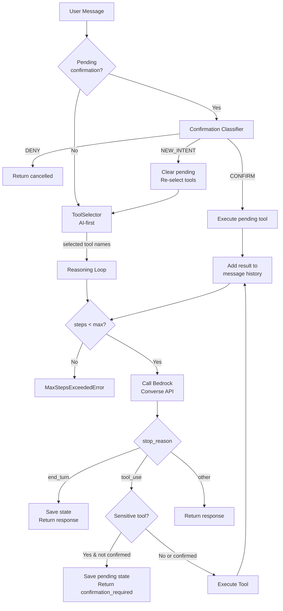
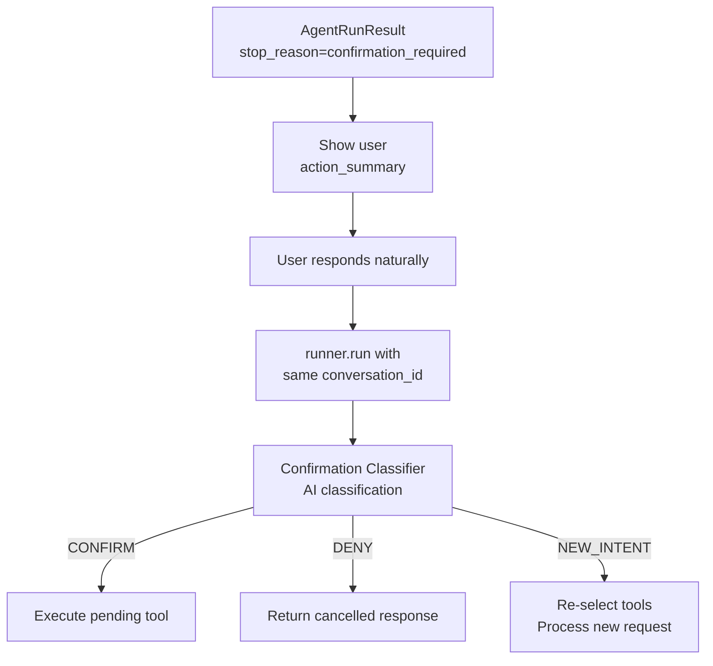

# Personal AI Assistant

A locally-hosted AI assistant that automates personal workflows through natural language conversation. 
Built as a practical exploration of agentic AI patterns, this project combines an LLM-powered reasoning loop with a modular 
tool registry to handle tasks, goals, and content curation autonomously.

**Key highlights:**

- **Agentic architecture** - Multi-step reasoning loop with AWS Bedrock (Claude Sonnet/Haiku) that dynamically selects and executes tools based on user intent
- **Tool registry pattern** - 22 domain-specific tools with JSON schema generation, risk-level classification, and human-in-the-loop confirmation for sensitive operations
- **Telegram integration** - Two-way conversational interface with session persistence, enabling both proactive alerts and interactive requests
- **Production-ready infrastructure** - Dagster orchestration, PostgreSQL persistence, FastAPI REST layer, and comprehensive observability

---

## Project Goal
This project is a personal, cloud-hosted AI assistant designed to automate day-to-day information workflows through a single conversational interface.

The assistant is accessed via a private 1:1 Telegram chat, where it can both proactively send notifications and respond interactively to questions and follow-up requests. 
It is intended to act as a persistent, context-aware assistant rather than a stateless chatbot.

The primary use cases include:
- summarising blog posts and articles received via email
- scraping and summarising daily content such as Medium digests
- answering questions and performing small automated tasks via natural language reducing manual overhead in recurring personal workflows
- connect to Notion data sources to help manage tasks and goals

The system maintains conversational context across sessions using persisted history and summaries, allowing it to build continuity over time.

## Architecture Overview

This section provides a high-level overview of how the system works, intended as context for designing new features and PRDs.

### System Components

```
┌─────────────────────────────────────────────────────────────────────────────┐
│                              INGRESS LAYER                                  │
├─────────────────────────────────────────────────────────────────────────────┤
│  Telegram Bot          │  FastAPI REST API       │  Dagster Schedules       │
│  (2-way chat, alerts)  │  (HTTP endpoints)       │  (cron-based triggers)   │
└─────────────────────────────────────────────────────────────────────────────┘
                                      │
                                      ▼
┌─────────────────────────────────────────────────────────────────────────────┐
│                              AI AGENT LAYER                                 │
├─────────────────────────────────────────────────────────────────────────────┤
│  ToolSelector          │  AgentRunner            │  ToolRegistry            │
│  (AI-first tool        │  (Bedrock Converse      │  (22 tools across        │
│   selection)           │   reasoning loop)       │   6 domains)             │
│                        │                         │                          │
│  • Analyses intent     │  • Multi-step execution │  • Tasks: CRUD           │
│  • Picks relevant      │  • HITL confirmation    │  • Goals: CRUD           │
│    tools (≤5)          │  • Max 5 steps/run      │  • Reading List: CRUD    │
│                        │                         │  • Ideas: CRUD           │
│                        │                         │  • Reminders: CRUD       │
│                        │                         │  • Memory: add/update    │
└─────────────────────────────────────────────────────────────────────────────┘
                                      │
                                      ▼
┌─────────────────────────────────────────────────────────────────────────────┐
│                            DOMAIN SERVICES                                  │
├─────────────────────────────────────────────────────────────────────────────┤
│  NotionClient          │  AlertService           │  NewsletterService       │
│  (Notion API wrapper)  │  (unified alerts)       │  (email processing)      │
│                        │                         │                          │
│  • Query databases     │  • Provider-based arch  │  • Fetch from Graph API  │
│  • Create/update pages │  • Format & send alerts │  • Parse HTML content    │
│  • Validate enums      │  • Track sent status    │  • Extract articles      │
└─────────────────────────────────────────────────────────────────────────────┘
                                      │
                                      ▼
┌─────────────────────────────────────────────────────────────────────────────┐
│                            EXTERNAL SERVICES                                │
├─────────────────────────────────────────────────────────────────────────────┤
│  Notion API            │  Telegram Bot API       │  Microsoft Graph API     │
│  (task/goal storage)   │  (messaging)            │  (email access)          │
│                        │                         │                          │
│  AWS Bedrock           │  PostgreSQL             │  GlitchTip               │
│  (LLM inference)       │  (local persistence)    │  (error tracking)        │
└─────────────────────────────────────────────────────────────────────────────┘
```

### Data Flow Patterns

**1. Newsletter Pipeline (Scheduled)**
```
Dagster Schedule → Graph API (fetch emails) → Parser (extract articles)
    → PostgreSQL (store) → AlertService (alert) → Telegram Bot API
```

**2. API Request (HTTP)**
```
HTTP Request → FastAPI → Domain Client (Notion/etc) → External API
    → Response transformation → HTTP Response
```

**3. Agent Request (Telegram Chat)**
```
User Message → PollingRunner → MessageHandler → SessionManager
    → AgentRunner (ToolSelector + reasoning loop)
    → Tool Execution → API → Domain Client → External API
    → AgentRunner (continue/finish) → Response to User
```

**4. Reminder Pipeline (Scheduled)**
```
Dagster Schedule (5min) → ReminderService → Check due schedules
    → Create instances → Send via Telegram (with inline buttons)
    → User taps button → Callback handler → Acknowledge/Snooze → Update database
```

### Key Design Decisions

| Decision                   | Rationale                                                                                   |
|----------------------------|---------------------------------------------------------------------------------------------|
| **Thin API layer**         | Endpoints only handle HTTP concerns; business logic lives in domain modules                 |
| **Agent tools call API**   | Tools are HTTP wrappers to the internal API, ensuring single source of truth for validation |
| **Watermark extraction**   | Incremental processing prevents reprocessing old data                                       |
| **HITL for sensitive ops** | Create/update/delete require explicit user confirmation                                     |
| **Single Telegram chat**   | Private 1:1 assistant, not a multi-user bot                                                 |
| **Dagster over Celery**    | Better observability, native scheduling, no Redis dependency                                |

### Class-Based Architecture

The codebase uses a layered class-based approach for scalability and testability:

```
┌─────────────────┐     ┌─────────────────┐     ┌─────────────────┐
│     Client      │     │ Handler/Service │     │     Runner      │
│  (I/O boundary) │ ──▶ │ (business logic)│ ──▶ │ (orchestration) │
└─────────────────┘     └─────────────────┘     └─────────────────┘
   TelegramClient         MessageHandler          PollingRunner
   NotionClient           AlertService            AgentRunner
   BedrockClient          SessionManager
```

**Layer Responsibilities:**

| Layer               | Purpose                             | Examples                                            |
|---------------------|-------------------------------------|-----------------------------------------------------|
| **Client**          | I/O boundary with external APIs     | `TelegramClient`, `NotionClient`, `BedrockClient`   |
| **Handler/Service** | Business logic and orchestration    | `MessageHandler`, `AlertService`, `SessionManager`  |
| **Runner**          | Long-running processes and loops    | `PollingRunner`, `AgentRunner`                      |
| **Settings**        | Configuration via pydantic-settings | `TelegramSettings`, `AgentConfig`                   |

**Why Classes Over Functions:**

1. **Encapsulated State**: Configuration and credentials injected once at construction, not passed to every function call
2. **Dependency Injection**: Easy to swap real implementations for mocks in tests
3. **Single Responsibility**: Each class does one thing well (`MessageHandler` processes messages, `SessionManager` manages sessions)
4. **Lifecycle Management**: Runners can start, stop, and handle graceful shutdown
5. **Configuration Locality**: All settings in one validated object via pydantic-settings

**When to Use Functions vs Classes:**

| Use Functions                          | Use Classes                              |
|----------------------------------------|------------------------------------------|
| Pure transformations (`parse_html()`)  | Stateful operations (clients with auth)  |
| One-off utilities (`format_message()`) | Multi-step workflows (runners, handlers) |
| No dependencies needed                 | Dependencies that should be injected     |
| No configuration                       | Configuration-driven behaviour           |

### Module Boundaries

```
src/
├── agent/           # AI agent runtime (Bedrock, tools, registry)
├── alerts/          # Alert service with pluggable providers
├── api/             # FastAPI endpoints (thin HTTP layer)
├── dagster/         # Orchestration jobs and schedules
├── database/        # SQLAlchemy models and operations
├── graph/           # Microsoft Graph API client
├── newsletters/     # Content extraction (TLDR, Medium)
├── notion/          # Notion API client and models
├── observability/   # Error tracking (Sentry/GlitchTip)
├── substack/        # Substack API client and parsing
├── messaging/       # Messaging providers
│   └── telegram/    # Telegram Bot client, polling, handlers
└── utils/           # Logging configuration
```

### Technology Stack

| Layer            | Technology                    |
|------------------|-------------------------------|
| Language         | Python 3.12+                  |
| API Framework    | FastAPI                       |
| Database         | PostgreSQL + SQLAlchemy       |
| Orchestration    | Dagster                       |
| AI/LLM           | AWS Bedrock (Claude)          |
| Messaging        | Telegram Bot API              |
| Email Access     | Microsoft Graph API           |
| Error Tracking   | GlitchTip (Sentry-compatible) |
| Containerisation | Docker Compose                |

### PRD Context

When writing PRDs for this project, consider:

1. **Where does ingress come from?** (Telegram, API, Schedule)
2. **Does it need AI reasoning?** (Use agent layer) or **Direct execution?** (Call domain service)
3. **What external APIs are involved?** (Notion, Telegram, Graph, Bedrock)
4. **Is persistence needed?** (PostgreSQL tables, watermarks)
5. **Are there safety concerns?** (HITL confirmation for destructive ops)
6. **How will it be tested?** (Unit tests with mocking, follow existing patterns)

Existing PRDs are in `.claude/prds/` and follow a consistent structure with overview, features, implementation notes, and checklist.

### Areas for Improvement
1. Integration tests - currently all tests use mocking
2. Structured logging - JSON format for production observability
3. Telegram webhook mode - currently polling only (see `.claude/prds/` for Phase 2B)

## Setup

### Prerequisites
- Python 3.12+
- Poetry

### Installation
```bash
poetry install
```

### Configuration
Copy `.env_example` to `.env` and populate the required values.

#### Logging
Logging outputs to stdout. Configure via environment variables:
- `LOG_LEVEL`: DEBUG, INFO, WARNING, ERROR, CRITICAL (default: INFO)
- `LOG_UVICORN_ACCESS`: Enable uvicorn access logs (default: false)

#### Database
PostgreSQL database for storing newsletters and articles.

For local development:
- `DATABASE_HOST`: Database host (default: localhost)
- `DATABASE_PORT`: Database port (default: 5432)

For Docker (used by init script to create databases/users):
- `POSTGRES_USER`: PostgreSQL superuser
- `POSTGRES_PASSWORD`: PostgreSQL superuser password
- `APP_DB_PASSWORD`: Password for `app` user (main application)
- `DAGSTER_DB_PASSWORD`: Password for `dagster` user (orchestration)
- `GLITCHTIP_DB_PASSWORD`: Password for `glitchtip` user (error tracking)

#### Telegram
Send newsletter alerts and enable two-way chat via Telegram bot:
- `TELEGRAM_BOT_TOKEN`: Bot token from @BotFather (required)
- `TELEGRAM_ALLOWED_CHAT_IDS`: Comma-separated list of allowed chat IDs (required)
- `TELEGRAM_CHAT_ID`: Target chat ID for newsletter alerts (optional)
- `TELEGRAM_MODE`: Transport mode - `polling` (default) or `webhook`
- `TELEGRAM_POLL_TIMEOUT`: Long polling timeout in seconds (default: 30, range: 1-60)
- `TELEGRAM_SESSION_TIMEOUT_MINUTES`: Session inactivity timeout (default: 10, range: 1-60)
- `TELEGRAM_ERROR_RETRY_DELAY`: Delay between error retries in seconds (default: 5)
- `TELEGRAM_MAX_CONSECUTIVE_ERRORS`: Errors before backing off (default: 5)
- `TELEGRAM_BACKOFF_DELAY`: Backoff delay after max errors in seconds (default: 30)

Start the database with Docker:
```bash
docker-compose up -d
```

Run migrations:
```bash
poetry run alembic upgrade head
```

## Features

### Newsletter Extraction
Fetches newsletters from multiple sources and stores articles/posts in PostgreSQL with incremental extraction.

Uses watermark-based incremental extraction to track the last processed timestamp, ensuring only new content is fetched on each run. The watermark can be overridden via Dagster job configuration for backfills.

#### TLDR Newsletters (Email)
Fetches TLDR newsletters from Outlook via Microsoft Graph API, extracts articles, and stores them in the `email_newsletters` and `email_articles` tables.

Supported newsletters:
- TLDR (general tech news)
- TLDR AI (AI/ML focused)
- TLDR Dev (developer focused)

#### Substack Publications
Fetches posts from configured Substack publications via the Substack API, stores them in the `substack_newsletters` and `substack_posts` tables.

Publications are fetched dynamically from the configured Substack user's subscriptions.

Features:
- Incremental extraction using watermarks
- Paywalled post detection (shown with "(Paid)" indicator in alerts)
- Grouped alerts with posts organised by publication

### Unified Alert System
Proactive Telegram notifications using a provider-based architecture. All alerts are tracked in the `sent_alerts` table to prevent duplicates.

#### Alert Types
| Type           | Schedule                      | Description                                                  |
|----------------|-------------------------------|--------------------------------------------------------------|
| Newsletter     | Hourly (configurable)         | Article summaries from TLDR newsletters                      |
| Substack       | Hourly (configurable)         | New posts from Substack publications, grouped by publication |
| Medium         | Hourly (configurable)         | Articles from Medium daily digests                           |
| Task           | Multiple daily (configurable) | Overdue tasks, due today, high priority items                |
| Goal           | Weekly (configurable)         | Active goals with progress status                            |
| Reading        | Weekly (configurable)         | High priority and stale reading items                        |

#### Architecture
The alert system uses a provider pattern:
- **AlertProvider**: Protocol defining `get_pending_alerts()` and `mark_sent()`
- **AlertService**: Orchestrator that sends alerts via TelegramClient and tracks them
- **Formatters**: HTML message formatting per alert type

Providers:
- `NewsletterAlertProvider` - Queries database for unsent TLDR newsletters
- `SubstackAlertProvider` - Queries database for unsent Substack posts
- `MediumAlertProvider` - Queries database for unsent Medium digests
- `TaskAlertProvider` - Queries API for overdue/due tasks
- `GoalAlertProvider` - Queries API for active goals
- `ReadingAlertProvider` - Queries API for high priority/stale reading items

### Telegram Chat
Two-way conversational interface for interacting with the AI agent via Telegram. Supports multi-turn conversations with session persistence.

#### Features
- **Session Management**: Conversations persist for 10 minutes of inactivity (configurable)
- **Agent Integration**: Messages are routed to the AI agent for tool-calling workflows
- **HITL Confirmation**: Sensitive operations require user confirmation via natural language
- **Chat Allowlist**: Restrict bot access to specific chat IDs

#### Commands
- `/newchat`: Reset the current session and start fresh

#### Architecture
The Telegram integration uses long polling to receive updates. Each chat is assigned a session that links to an `AgentConversation` for AI state management.

```
User Message → PollingRunner → MessageHandler
    → SessionManager (get/create session)
    → AgentRunner (reasoning loop)
    → Response → TelegramClient.send_message()
```

Sessions are stored in PostgreSQL with the following tables:
- `telegram_sessions`: Chat session state and links to agent conversations
- `telegram_messages`: Audit log of all messages (user and assistant)
- `telegram_polling_cursor`: Persisted update_id for reliable polling

### Persistent Memory
The agent maintains persistent memory across conversations, allowing it to recall facts, preferences, and context from previous sessions.

#### Features
- **Proactive learning**: Agent notices information worth remembering and asks before storing
- **Memory categories**: Person (people), Preference (user preferences), Context (recurring context), Project (project-specific info)
- **Version history**: Updates create new versions, preserving full history of changes
- **Token-efficient IDs**: Short 8-character alphanumeric IDs instead of UUIDs
- **Prompt caching**: Memory loaded once per conversation with deterministic ordering

#### How It Works
1. User shares information ("Alec is my boss")
2. Agent asks for confirmation ("Should I remember that for future conversations?")
3. User confirms → memory stored with category and optional subject
4. In future conversations, memory is included in the system prompt
5. Agent can update memories when information changes (no confirmation needed for updates)

#### Memory Format in Context
Memories are grouped by category and include IDs for reference:
```
### Person
- [id:a1b2c3d4] [Alec] Alec is my boss at TechCorp

### Preference
- [id:e5f6g7h8] User prefers tasks due on Fridays
```

#### Storage
Memory uses two PostgreSQL tables:
- `agent_memories`: Memory metadata (id, category, subject, lifecycle)
- `agent_memory_versions`: Content history with version tracking

### User Reminders
Set one-time and recurring reminders via the AI agent, delivered via Telegram with acknowledgement buttons.

#### Features
- **One-time reminders**: Trigger at a specific date/time ("remind me to call Mum at 7pm")
- **Recurring reminders**: Cron-based schedules ("remind me every weekday at 9am")
- **Persistent nudging**: Re-sends every 30 minutes until acknowledged (max 3 attempts)
- **Inline buttons**: Acknowledge or snooze reminders directly in Telegram
- **Snooze options**: 1 hour, 3 hours, or tomorrow morning

#### Agent Commands
- "Remind me to take vitamins at 8am tomorrow"
- "Set a reminder for standup every weekday at 9:30am"
- "Show me my active reminders"
- "Cancel the standup reminder"

#### Architecture
Reminders use a two-table model:
- `reminder_schedules`: Defines when reminders should trigger (one-time or recurring via cron)
- `reminder_instances`: Tracks each triggered instance awaiting acknowledgement

A Dagster job runs every 5 minutes to:
1. Check for schedules due to trigger
2. Create new instances for due schedules
3. Send pending instances via Telegram with inline buttons
4. Expire instances that have exceeded max send attempts

When users tap inline buttons, a dedicated callback handler processes acknowledgement/snooze actions without triggering the AI agent.

### Scheduled Processing
Newsletter processing and alerting runs automatically using Dagster for orchestration.

#### Configuration
- `DAGSTER_WEBSERVER_PORT`: Dagster webserver UI port (default: 3000)

#### Running with Docker
Start all services including the scheduler:
```bash
docker-compose up -d
```

This starts:
- PostgreSQL database with three databases and users:
  - `personal_ai_automation` (user: `app`) - main application data
  - `dagster` (user: `dagster`) - orchestration storage
  - `glitchtip` (user: `glitchtip`) - error tracking
- Dagster webserver (UI at http://localhost:3000)
- Dagster daemon (runs schedules)
- FastAPI (API at http://localhost:8000)
- GlitchTip (error tracking at http://localhost:8001)

#### Running Locally
Run Dagster dev server for local development:
```bash
poetry run dagster dev
```

This uses SQLite storage and doesn't require PostgreSQL.

### REST API
FastAPI REST API for health checks and future endpoints.

#### Configuration
- `API_AUTH_TOKEN`: Bearer token for API authentication
- `API_PORT`: API server port (default: 8000)

#### Running with Docker
The API service starts automatically with docker-compose. Access OpenAPI documentation at http://localhost:8000/docs.

#### Endpoints

##### Health
| Method | Path    | Auth | Description  |
|--------|---------|------|--------------|
| GET    | /health | No   | Health check |

##### Notion (Generic)
| Method | Path                                        | Auth | Description                       |
|--------|---------------------------------------------|------|-----------------------------------|
| GET    | /notion/databases/{database_id}             | Yes  | Retrieve database structure       |
| GET    | /notion/data-sources/{data_source_id}       | Yes  | Retrieve data source config       |
| POST   | /notion/data-sources/{data_source_id}/query | Yes  | Query all pages (auto-pagination) |
| GET    | /notion/data-sources/templates              | Yes  | List data source templates        |
| GET    | /notion/pages/{page_id}                     | Yes  | Retrieve a single page            |
| POST   | /notion/pages                               | Yes  | Create a new page                 |
| PATCH  | /notion/pages/{page_id}                     | Yes  | Update page properties            |

##### Tasks (Task Tracker)
| Method | Path                | Auth | Description                              |
|--------|---------------------|------|------------------------------------------|
| POST   | /notion/tasks/query | Yes  | Query tasks with fuzzy name search       |
| GET    | /notion/tasks/{id}  | Yes  | Retrieve a task                          |
| POST   | /notion/tasks       | Yes  | Create a task with validated enum fields |
| PATCH  | /notion/tasks/{id}  | Yes  | Update a task                            |

##### Goals (Goals Tracker)
| Method | Path                   | Auth | Description                              |
|--------|------------------------|------|------------------------------------------|
| POST   | /notion/goals/query    | Yes  | Query goals with fuzzy name search       |
| GET    | /notion/goals/{id}     | Yes  | Retrieve a goal                          |
| POST   | /notion/goals          | Yes  | Create a goal with validated enum fields |
| PATCH  | /notion/goals/{id}     | Yes  | Update a goal                            |

##### Reading List
| Method | Path                       | Auth | Description                                |
|--------|----------------------------|------|--------------------------------------------|
| POST   | /notion/reading-list/query | Yes  | Query reading items with fuzzy name search |
| GET    | /notion/reading-list/{id}  | Yes  | Retrieve a reading item                    |
| POST   | /notion/reading-list       | Yes  | Create a reading item with validated enums |
| PATCH  | /notion/reading-list/{id}  | Yes  | Update a reading item                      |

##### Ideas
| Method | Path                 | Auth | Description                               |
|--------|----------------------|------|-------------------------------------------|
| POST   | /notion/ideas/query  | Yes  | Query ideas with fuzzy name search        |
| GET    | /notion/ideas/{id}   | Yes  | Retrieve an idea                          |
| POST   | /notion/ideas        | Yes  | Create an idea with validated enum fields |
| PATCH  | /notion/ideas/{id}   | Yes  | Update an idea                            |

##### Reminders
| Method | Path                 | Auth | Description                                      |
|--------|----------------------|------|--------------------------------------------------|
| POST   | /reminders/query     | Yes  | Query reminders with optional filters            |
| GET    | /reminders/{id}      | Yes  | Retrieve a reminder schedule                     |
| POST   | /reminders           | Yes  | Create a one-time or recurring reminder          |
| PATCH  | /reminders/{id}      | Yes  | Update a reminder schedule                       |
| DELETE | /reminders/{id}      | Yes  | Cancel (deactivate) a reminder                   |

##### Memory
| Method | Path             | Auth | Description                                      |
|--------|------------------|------|--------------------------------------------------|
| GET    | /memory          | Yes  | List all active memories                         |
| GET    | /memory/{id}     | Yes  | Retrieve a memory with version history           |
| POST   | /memory          | Yes  | Create a new memory entry                        |
| PATCH  | /memory/{id}     | Yes  | Update a memory (creates new version)            |
| DELETE | /memory/{id}     | Yes  | Soft-delete a memory                             |

##### Fuzzy Name Search
All query endpoints support fuzzy name matching via `name_filter` parameter. Results are scored using `partial_ratio` matching and returned with a quality indicator:
- `fuzzy_match_quality: "good"` - Best match score >= 60 (confident matches)
- `fuzzy_match_quality: "weak"` - No matches above threshold (best guesses)
- `fuzzy_match_quality: null` - No name filter provided (unfiltered results)

By default, completed items are excluded from queries. Use the `include_done` or `include_completed` flags to search all items.

### AI Agent
Standalone AI agent layer that uses AWS Bedrock Converse with tool use to safely execute internal tools. The agent provides structured tool calling via LLMs with validation and safety guardrails.

#### Components
- **AgentRunner**: Main execution loop for tool-based LLM workflows
- **ToolRegistry**: Central registry for available tools with JSON schema generation
- **ToolSelector**: AI-first tool selection using Bedrock Converse with fallback to keyword matching
- **BedrockClient**: Typed client for AWS Bedrock Converse API
- **AgentAPIClient**: HTTP client for tools to call internal API endpoints

#### Configuration
- `AWS_REGION`: AWS region for Bedrock (default: eu-west-2)
- `AGENT_SELECTOR_MODEL`: Model for tool selection - haiku, sonnet, or opus (default: haiku)
- `AGENT_CHAT_MODEL`: Model for chat/tool execution - haiku, sonnet, or opus (default: sonnet)
- `API_BASE_URL`: Base URL for internal API (default: http://localhost:8000)
- `API_AUTH_TOKEN`: Bearer token for API authentication (shared with REST API)

#### Tool Risk Levels
- **Safe**: Read-only or additive operations (e.g., query, get)
- **Sensitive**: Destructive or irreversible operations (e.g., create, update, delete)

#### Name Validation
When creating items, the agent validates names to ensure they are descriptive and findable later. Each domain has configurable minimum length and word requirements. 
If validation fails, the tool returns `needs_clarification: true` with the validation rules. The LLM will prompt for a more specific name. 
Users can override by insisting on the original name.

#### Structured Content
When creating items, the agent provides structured inputs that are automatically formatted into page content:

| Domain       | Required Inputs | Optional Inputs | Output Format                          |
|--------------|-----------------|-----------------|----------------------------------------|
| Tasks        | `description`   | `notes`         | Description section + notes + footer   |
| Goals        | `description`   | `notes`         | Description section + notes + footer   |
| Reading List | -               | `notes`         | Notes section + footer                 |
| Ideas        | `notes`         | -               | Notes section + footer                 |

The agent cannot create arbitrary content - it must use these structured fields, which are then formatted via templates with an "AI Agent" attribution footer. This ensures consistent, well-structured page content.

#### Available Tools
The agent has 22 built-in tools organised by domain:

| Domain       | Tools                                                                          |
|--------------|--------------------------------------------------------------------------------|
| Tasks        | query_tasks, get_task, create_tasks, update_task                               |
| Goals        | query_goals, get_goal, create_goals, update_goal                               |
| Reading List | query_reading_list, get_reading_item, create_reading_list, update_reading_item |
| Ideas        | query_ideas, get_idea, create_ideas, update_idea                               |
| Reminders    | create_reminder, query_reminders, update_reminder, cancel_reminder             |
| Memory       | add_to_memory, update_memory (system tools, always available)                  |

#### Agent Runner
The AgentRunner executes the reasoning and tool-calling loop with safety guardrails:

- **Max-step enforcement**: Limits tool calls per run (default: 5)
- **HITL confirmation**: Sensitive tools require user confirmation before execution
- **Sequential execution**: One tool per step, no parallel execution
- **Graceful error handling**: Tool failures are captured and fed back to the model

##### How the AgentRunner Works - Main Execution Loop

1. User Message Arrives: The user sends a request like "Show me my high priority tasks"
2. Tool Selection (ToolSelector):
   - Uses AI to analyse the intent and select relevant tools from the registry
   - Falls back to keyword matching if AI fails
   - Returns a list of tool names (e.g., ["query_tasks"])
3. Agent Run Starts (AgentRunner.run):
   - Loads or creates conversation state from database
   - Checks for pending confirmations from previous runs
   - Builds Bedrock tool config from selected tools
   - Enters the reasoning loop
4. The Reasoning Loop (runs until completion):
   - Step limit check: If steps ≥ 5, raises MaxStepsExceededError
   - Call Bedrock Converse API: Sends messages + tool schemas
   - Check stop_reason:
     - end_turn → LLM is done, return final response
     - tool_use → LLM wants to call a tool
     - other → Unexpected, return what we have
5. Tool Use Handling:
   - Parse which tool the LLM wants to call
   - **If sensitive tool** (create/update/delete):
     - Check if already confirmed
     - If not confirmed → save pending confirmation to conversation state, return confirmation_required
   - **If safe tool** (query/get):
       - Execute immediately
   - Add tool result to message history
   - Loop back for next LLM call
6. HITL Confirmation Flow (Stateful):
   - When a sensitive tool is requested, the agent pauses and saves state
   - Returns AgentRunResult with stop_reason="confirmation_required"
   - Next call with same conversation_id classifies user's response:
     - "yes", "sure", "go ahead" → CONFIRM → execute the pending tool
     - "no", "cancel", "stop" → DENY → cancel and return
     - New request → NEW_INTENT → re-select tools and process new request
7. Context Management:
   - Message history preserved across runs in conversation state
   - Sliding window (default 20 messages) triggers summarisation
   - Older messages summarised to maintain context without token overflow

#### Execution Flow



##### HITL Confirmation Flow (Stateful)



The agent:
- Automatically selects relevant tools using Haiku and executes with Sonnet
- Maintains conversation context across multiple runs
- Classifies natural language confirmations ("yep", "sure", "no thanks")
- Applies sliding window summarisation to manage context length

#### Cost and Token Tracking
The agent automatically tracks all LLM calls, tokens, and costs. Each Bedrock API call is recorded with:
- Request messages and response content (stored as JSONB)
- Input, output, cache-read, and cache-write token counts
- Estimated cost based on model pricing
- Call latency in milliseconds
- Call type (chat, selector, classifier, or summariser)

Tracking data is organised in three tables:
- **agent_conversations**: Multi-run conversation containers with context state and aggregated totals
- **agent_runs**: Individual executions with user message, response, and step count
- **llm_calls**: Individual Bedrock API calls with full request/response data

##### Model Pricing
Costs are estimated per 1,000 tokens:

| Model  | Input   | Output  | Cache Read | Cache Write |
|--------|---------|---------|------------|-------------|
| Haiku  | $0.001  | $0.005  | $0.0001    | $0.00125    |
| Sonnet | $0.003  | $0.015  | $0.0003    | $0.00375    |
| Opus   | $0.005  | $0.025  | $0.0005    | $0.00625    |

##### Prompt Caching Strategy
The agent uses AWS Bedrock's prompt caching to reduce costs for multi-turn conversations. Cache reads are charged at 10% of the input rate (90% savings), while cache writes cost 125% of the input rate (25% premium).

**System Prompt Caching**
The system prompt is fully static with no dynamic content (datetime, user info, etc.). This ensures the ~400 token system prompt is cached once and reused across all turns.

**Tool Configuration Caching**
Tools are organised by domain (e.g., `domain:tasks`, `domain:goals`). Each domain has a cache point placed after its tools in the tool configuration:

```
[task_tools...] → cachePoint → [goal_tools...] → cachePoint → [reminder_tools...]
```

This incremental caching strategy means:
1. First turn: Cache write for system prompt + selected domains
2. Subsequent turns with same domains: Cache read (90% savings)
3. Adding a new domain: Cache read for existing domains + cache write for new domain only

**Domain Ordering for Cache Stability**
When merging domains across turns, existing domains are placed first to maintain cache order:
- Turn 1 selects `[tasks]` → cached
- Turn 2 adds `[goals]` → merged as `[tasks, goals]` → tasks cache hit, goals cache write
- Turn 3 continues → `[tasks, goals]` cache hit for both

**Expected Cache Efficiency**
For typical multi-turn conversations:
- ~86% cache read rate after the first turn
- Break-even after 2 turns (cache write premium recovered by cache reads)
- Significant savings for longer conversations

### Notion Integration
API wrapper for Notion to query and manage tasks, goals, reading items, and ideas. The generic endpoints work with any data source, while the typed endpoints use pre-configured data sources with validated field values.

#### Configuration
- `NOTION_INTEGRATION_SECRET`: Notion integration token from https://www.notion.so/my-integrations
- `NOTION_TASK_DATA_SOURCE_ID`: Data source ID for the task tracker
- `NOTION_GOALS_DATA_SOURCE_ID`: Data source ID for the goals tracker
- `NOTION_READING_LIST_DATA_SOURCE_ID`: Data source ID for the reading list
- `NOTION_IDEAS_DATA_SOURCE_ID`: Data source ID for the ideas tracker

#### Field Validation
All Notion endpoints validate field values using enums defined in `src/notion/enums.py`. Each domain (Tasks, Goals, Reading List, Ideas) has 
its own set of valid values for fields like status, priority, and category. Invalid values are rejected with descriptive error messages.
